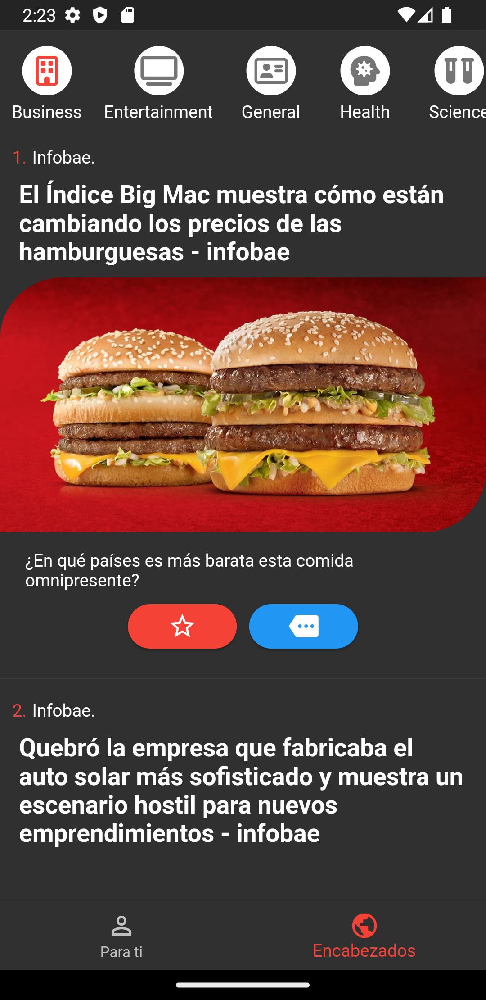
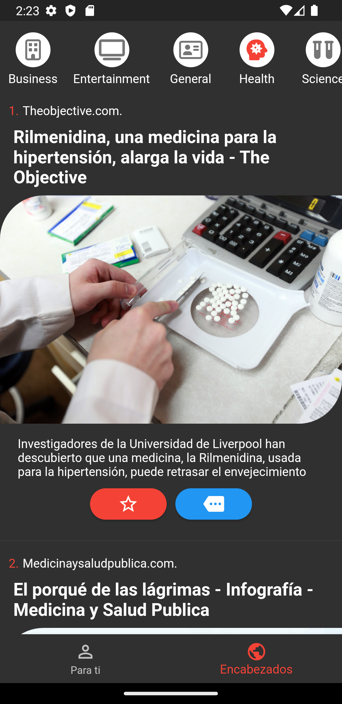

# News app provider

This is a practice project to see the potential of flutter and practice using the api with it.

The project, in addition to what was commented, has characteristics such as:

- Provider
- Custom theme
- Json convert
- Tab navigation

  
  
  
  
  
  

